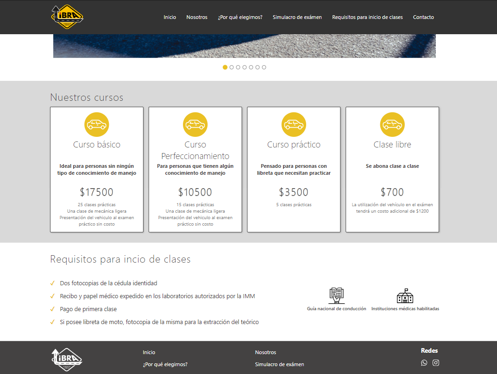
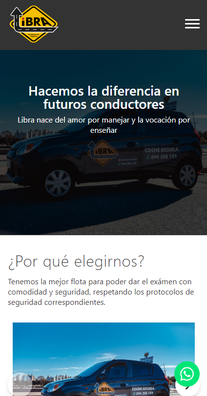

# 🚧 Drivers Academy App

## 🎉 What do it doing?

This is a Libra drivers academy app. First is a landing home page, where shoe the most important features, you'll find some sections like why choose us, our courses, requirements for the begin class, papers for help you to studied for the theory exam and the medical institutions you can visit, also you'll find contact information in the footer page.

Additionally, you'll have a question app available to practice your theoretical exam. This app shows some aleatory questions and you see how many answers were true.

## 🔧 How to install

If you like this project I invite you to clone my project whit fork and if you find somethings to improve make me a pull request, I'll be facinated to see this.

1. Clone the repository
2. Inside the folder where you clone the repository open console and execute `npm install`
3. Then execute `npm run dev` and enjoy the project 🥳

|  | |
| ----------------- | :----------------------------: |
|  |  |
